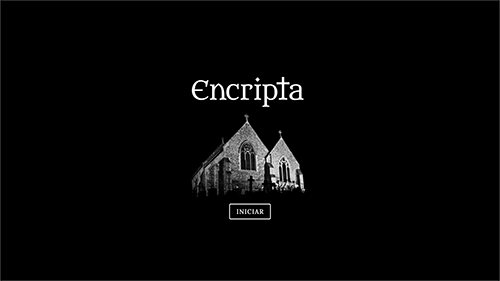

# Encripta
Pista ou solução, é você quem decide.

# Jogo

Encripta permite que o usuário brinque com a cifra de César, inserindo uma palavra e escolhendo um deslocamento. Esta palavra será cifrada ou decifrada dependendo do papel assumido pelo jogador: assassino ou detetive, gerando uma pista ou uma solução.

Acesse pelo GitHub Pages:

### Enredo

A cidade está em polvorosa, a catedral central foi palco de um episódio terrível. O bondoso padre João foi encontrado com um ferimento na cabeça, já sem vida, na cripta da igreja. 

Na primeira página do jornal a manchete: 

> Criptografia na cripta

Segundo a reportagem, uma mensagem cifrada foi deixada pelo assassino como pista na cena do crime usando uma criptografia antiga: a Cifra de César. 

Qual será o desfecho do "Crime da Cripta"?

Escolha um personagem:
- **Assassino**: cifre uma pista para cena do crime. 
- **Detetive**: decifre a pista e solucione o caso.

# Objetivos

Escolher um número de casas para o deslocamento da Cifra de César, inserir uma mensagem que será cifrada ou decifrada a partir da escolha de um dos personagens.

# Usuários

- Interessados em geral, com apelo maior para fãs de narrativas de mistério e suspense.

# Prototipação

Na primeira sprint do projeto o foco foi a concepção do produto e suas funcionalidades básicas.

Já na segunda semana novas telas foram desenvolvidas, ampliando a narrativa: 

> Clique nas imagens para assistir a animação das telas

Uma das melhorias na versão 2.0 do desenho de experiência foi a melhoria do input de deslocamento.
Segundo comentários de usuários do MVP a interação com o valor não estava clara. Alguns estudos pós entrevistas:

# Autoria

Tamires Cordeiro – [@mirescordeiro](https://twitter.com/mirescordeiro)

A partir de projeto base da [@Laboratoria](https://github.com/Laboratoria)
